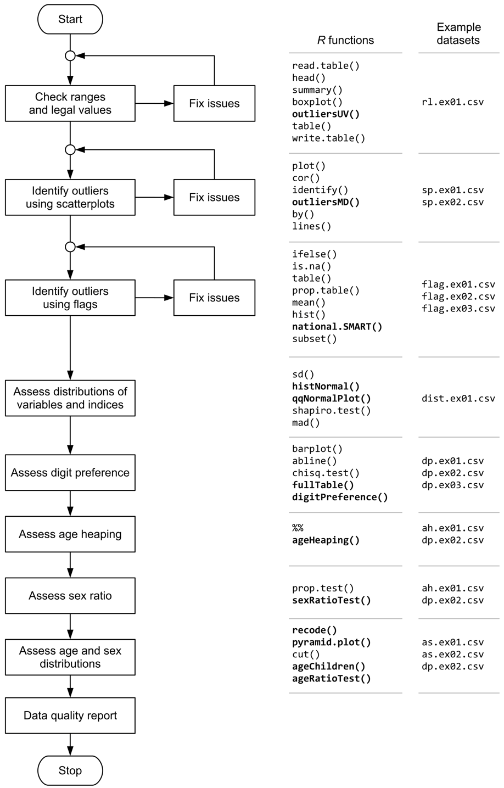

<!-- README.md is generated from README.Rmd. Please edit that file -->

# nipnTK: National Information Platforms for Nutrition (NiPN) data quality toolkit

<!--  -->

[](http://www.repostatus.org/#wip)
[](https://www.tidyverse.org/lifecycle/#maturing)
[](https://cran.r-project.org/package=nipnTK)
[](https://CRAN.R-project.org/package=nipnTK)
[](https://cran.r-project.org/package=nipnTK)
[](https://travis-ci.org/nutriverse/nipnTK)
[](https://ci.appveyor.com/project/nutriverse/nipnTK)
[](https://codecov.io/gh/nutriverse/nipnTK)

[National Information Platforms for Nutrition
(NIPN)](http://www.nipn-nutrition-platforms.org) is an initiative of the
European Commission to provide support to countries to strengthen their
information systems for nutrition and to improve the analysis of data so
as to better inform the strategic decisions they are faced with to
prevent malnutrition and its consequences.

As part of this mandate, NiPN has commissioned work on the development
of a toolkit to assess the quality of various nutrition-specific and
nutrition-related data. This is a companion R package to the toolkit of
practical analytical methods that can be applied to variables in
datasets to assess their quality.

The focus of the toolkit is on data required to assess anthropometric
status such as measurements of weight, height or length, MUAC, sex and
age. The focus is on anthropometric status but many of presented methods
could be applied to other types of data. NiPN may commission additional
toolkits to examine other variables or other types of variables.

## Requirements

  - R version 3.4 or higher

Extensive use is made of the R language and environment for statistical
computing. This is a free and powerful data analysis system. R provides
a very extensive language for working with data. This companion package
has been written using only a small subset of the R language. Many of
the data quality activities described in the toolkit are supported by R
functions included in this package that have been written specifically
for this purpose. These simplify the assessment of the quality of data
related to anthropometry and anthropometric indices.

## Installation

You can install the development version of nipnTK from GitHub with:

``` r
if(!require(remotes)) install.packages("remotes")
remotes::install_github("nutriverse/nipnTK")
```

## Usage

Data quality is assessed by:

1.  Range checks and value checks to identify *univariate* outliers.

2.  Scatterplots and statistical methods to identify *bivariate*
    outliers.

3.  Use of flags to identify outliers in anthropometric indices.

4.  Examining the distribution and the statistics of the distribution of
    measurements and anthropometric indices.

5.  Assessing the extent of digit preference in recorded measurements.

6.  Assessing the extent of age heaping in recorded ages.

7.  Examining the sex ratio.

8.  Examining age distributions and age by sex distributions.

These activities and a proposed order in which they should be performed
are shown below:

<!-- -->
